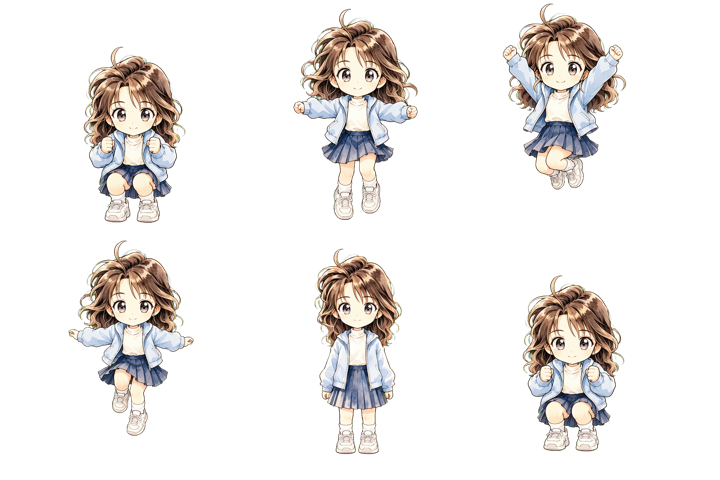
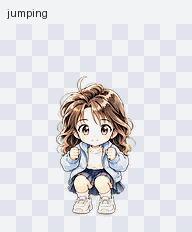
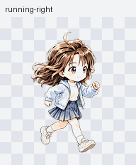
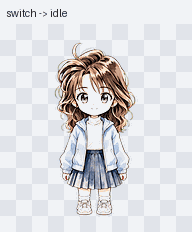
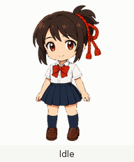

# Codex Pets

<p align="center">
  <a href="https://openai.com/codex/"></a>
  <a href="https://openai.com/zh-Hans-CN/index/introducing-chatgpt-images-2-0/"></a>
  
  <a href="https://www.apple.com.cn/"></a>
  <a href="https://www.microsoft.com/"></a>
</p>


一组为 Codex Desktop 打造的角色宠物。每个角色都包含完整动作和可直接安装的成品；分镜、脚本与质量记录也一并保留，方便继续扩展新的角色与动作。


## 分镜展示

<p align="center">
  <a href="pets/ran-mouri-chibi/"></a><br>
  跳跃<br><br>
  <a href="pets/ran-mouri-chibi/"></a><br>
  向右跑步
</p>

## 效果展示

<p align="center">
  <a href="pets/ran-mouri-chibi/"></a><br>
  跳跃<br><br>
  <a href="pets/ran-mouri-chibi/"></a><br>
  向右跑步
</p>


## 使用说明

### 1. 下载仓库

在 GitHub 页面选择 **Code → Download ZIP** 并解压，或使用 Git：

```bash
git clone https://github.com/haokwok2002/codex-pet.git
cd codex-pet
```

### 2. 选择角色并安装

| 角色 | 动画 | macOS / Linux | Windows PowerShell |
| --- | --- | --- | --- |
| [毛利兰 · 清晰 Q 版](pets/ran-mouri-chibi/) |  | `bash install.sh ran-mouri-chibi` | `powershell -ExecutionPolicy Bypass -File .\install.ps1 ran-mouri-chibi` |
| [红猪 · 飞行员 Q 版](pets/porco-rosso-chibi/) |  | `bash install.sh porco-rosso-chibi` | `powershell -ExecutionPolicy Bypass -File .\install.ps1 porco-rosso-chibi` |
| [宫水三叶 · 紧凑 Q 版](pets/mitsuha-miyamizu-chibi/) |  | `bash install.sh mitsuha-miyamizu-chibi` | `powershell -ExecutionPolicy Bypass -File .\install.ps1 mitsuha-miyamizu-chibi` |

也可以把下面这句话交给能操作本机终端的 Agent：

```text
请帮我安装 Codex Pet：https://github.com/haokwok2002/codex-pet；先问我想安装哪个角色，再自行判断系统、完成安装并告诉我结果。
```

### 3. 重启 Codex

安装完成后，重启 Codex Desktop，并在 Pet 选择界面启用角色。

## 项目结构

```text
codex-pet/
├── pets/
│   └── <pet-slug>/
│       ├── ready-to-use/          # 安装包、预览与安装脚本
│       └── production-pipeline/   # 分镜、设计、脚本与 QA
├── tools/                         # 多角色共用工具
└── docs/                          # 工作流与发布说明
```

`ready-to-use/` 面向安装；`production-pipeline/` 保留角色制作过程。维护细节见 [工作流](docs/WORKFLOW.md)、[维护笔记](docs/MAINTAINER-NOTES.md) 与 [发布检查表](docs/RELEASE-CHECKLIST.md)。

## 喜欢的话

如果这些宠物让你的 Codex 桌面更有意思，欢迎点一个 Star。它会让我知道该继续做更多角色和动作。

代码与文档采用 [MIT License](LICENSE)；角色与预览素材请参阅[素材使用说明](ASSET-LICENSE.md)。
