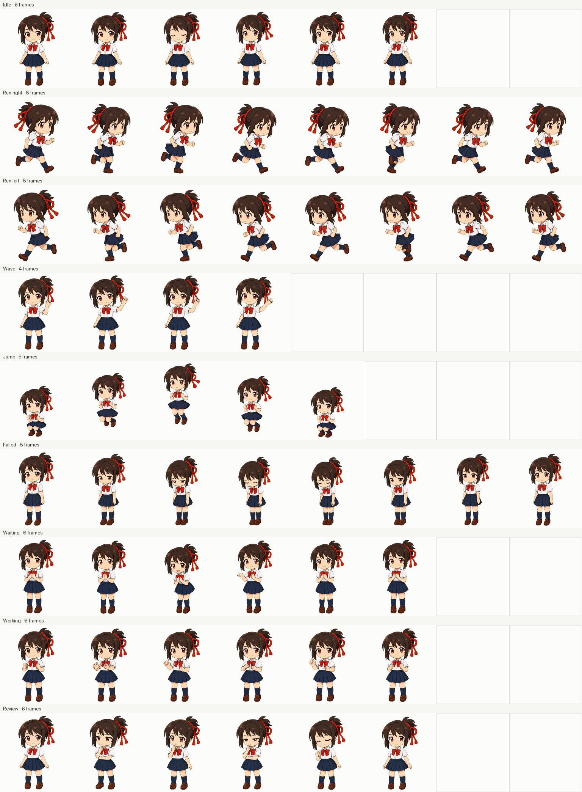

# 宫水三叶 · 紧凑 Q 版

适用于 Codex Desktop 的 Q 版宫水三叶宠物，包含完整动作与 16 个观察方向。


## 安装

在仓库根目录运行：

```bash
bash install.sh mitsuha-miyamizu-chibi
```

Windows PowerShell：

```powershell
powershell -ExecutionPolicy Bypass -File .\install.ps1 mitsuha-miyamizu-chibi
```

安装后重启 Codex Desktop，在 Pet 选择界面选择“三叶 · 紧凑Q版”。



制作资料和 QA 记录位于 [production-pipeline](production-pipeline/)。
