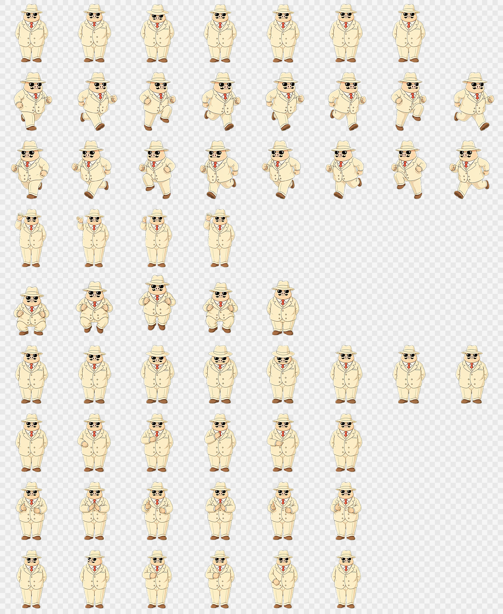

# 红猪 · 飞行员 Q 版

适用于 Codex Desktop 的红猪 Q 版飞行员宠物。


## 安装

在仓库根目录运行：

```bash
bash install.sh porco-rosso-chibi
```

Windows PowerShell：

```powershell
powershell -ExecutionPolicy Bypass -File .\install.ps1 porco-rosso-chibi
```

安装后重启 Codex Desktop，在 Pet 选择界面选择“红猪 · 飞行员Q版”。



制作资料和 QA 记录位于 [production-pipeline](production-pipeline/)。
